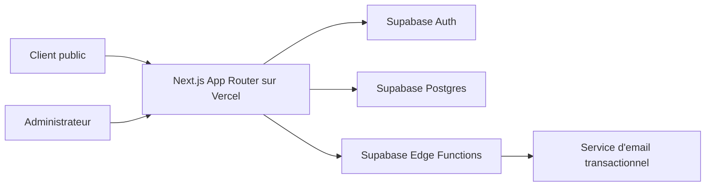
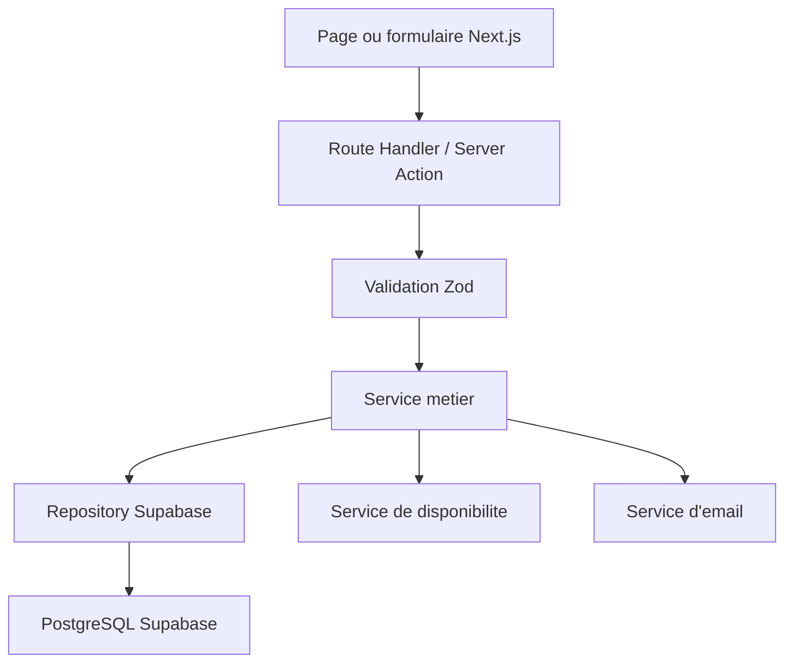
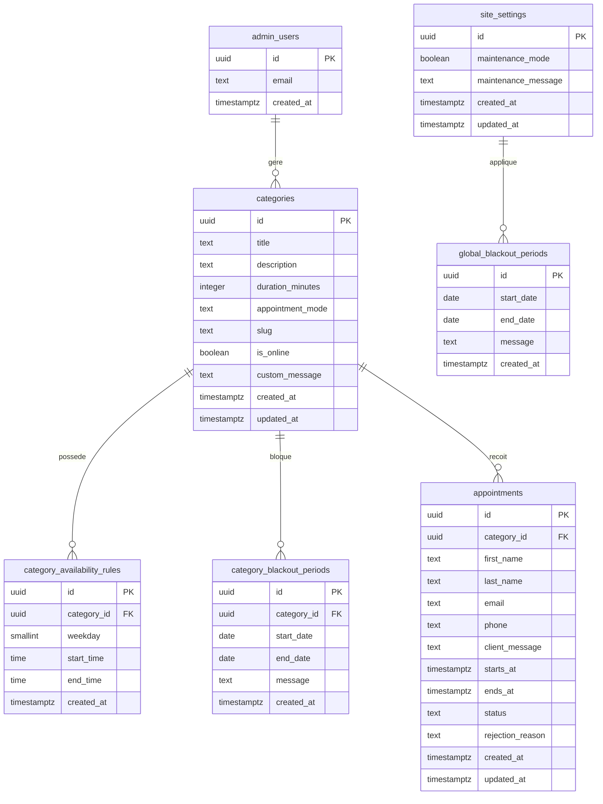

## 1. Conception de l'architecture


Architecture cible en couches :
- Frontend SSR/CSR hybride avec Next.js pour les pages publiques et admin.
- Backend applicatif leger via Route Handlers Next.js pour l'orchestration et via Supabase pour l'authentification, le stockage et la persistance.
- Logique metier critique centralisee dans une couche `services` afin d'eviter de dupliquer les regles entre le front et les endpoints.
- Notifications email declenchees par des fonctions serveur securisees, sans exposition de cles cote client.

## 2. Description des technologies
- Frontend : Next.js 15 avec React 19, TypeScript, App Router
- UI : Tailwind CSS 4, composants accessibles, formulaires reactifs
- Authentification : Supabase Auth, acces reserve a l'administrateur
- Base de donnees : Supabase PostgreSQL
- Backend : Next.js Route Handlers + Server Actions pour l'administration
- Emails : Supabase Edge Functions ou endpoint serveur, connectes a un service d'email transactionnel unique
- Deploiement : Vercel pour l'application, Supabase pour la base et l'authentification
- Observabilite minimale : journaux serveur Vercel et logs Supabase

## 3. Definitions des routes
| Route | But |
|-------|-----|
| `/` | Redirection vers une page d'accueil simple ou une page d'information |
| `/maintenance` | Affiche l'indisponibilite globale lorsque le mode maintenance est actif |
| `/rdv/[slug]` | Parcours public de reservation pour une categorie |
| `/rdv/[slug]/confirmation` | Confirmation visuelle apres envoi d'une demande |
| `/admin/login` | Connexion administrateur |
| `/admin` | Tableau de bord admin |
| `/admin/categories` | Liste des categories |
| `/admin/categories/nouvelle` | Creation d'une categorie |
| `/admin/categories/[id]` | Edition d'une categorie |
| `/admin/rendez-vous` | Liste et filtres des demandes |
| `/admin/rendez-vous/[id]` | Consultation et traitement d'une demande |
| `/admin/parametres` | Parametres globaux, maintenance et indisponibilites |
| `/api/public/availability/[slug]` | Retourne les creneaux disponibles d'une categorie |
| `/api/public/appointments` | Cree une demande de rendez-vous |
| `/api/admin/appointments/[id]/accept` | Accepte une demande et envoie l'email associe |
| `/api/admin/appointments/[id]/reject` | Refuse une demande avec motif et envoie l'email associe |

## 4. Definitions des API
### 4.1 Types TypeScript principaux
```ts
export type AppointmentStatus = "en_attente" | "accepte" | "refuse";
export type AppointmentMode = "telephone" | "physique" | "visioconference";
export type Weekday =
  | "lundi"
  | "mardi"
  | "mercredi"
  | "jeudi"
  | "vendredi"
  | "samedi"
  | "dimanche";

export interface AvailabilityWindow {
  start: string; // HH:mm
  end: string;   // HH:mm
}

export interface CategoryAvailabilityRule {
  weekday: Weekday;
  windows: AvailabilityWindow[];
}

export interface Category {
  id: string;
  title: string;
  description: string | null;
  durationMinutes: number;
  appointmentMode: AppointmentMode;
  slug: string;
  isOnline: boolean;
  customMessage: string | null;
}

export interface AppointmentRequestPayload {
  categorySlug: string;
  firstName: string;
  lastName: string;
  email: string;
  phone: string;
  message?: string;
  startsAt: string; // ISO datetime
}
```

### 4.2 `GET /api/public/availability/[slug]`
But : retourner les dates et creneaux disponibles pour une categorie active.

Reponse exemple :
```json
{
  "category": {
    "slug": "consultation-30min",
    "title": "Consultation 30 min",
    "durationMinutes": 30,
    "appointmentMode": "visioconference"
  },
  "maintenance": false,
  "disabledReason": null,
  "slots": [
    {
      "start": "2026-08-03T09:00:00.000Z",
      "end": "2026-08-03T09:30:00.000Z"
    }
  ]
}
```

### 4.3 `POST /api/public/appointments`
But : creer une demande de rendez-vous en statut `en_attente`.

Corps de requete :
```json
{
  "categorySlug": "consultation-30min",
  "firstName": "Marie",
  "lastName": "Durand",
  "email": "marie@example.com",
  "phone": "0600000000",
  "message": "Je souhaite parler de mon projet",
  "startsAt": "2026-08-03T09:00:00.000Z"
}
```

Reponse exemple :
```json
{
  "success": true,
  "appointmentId": "uuid",
  "status": "en_attente"
}
```

### 4.4 `POST /api/admin/appointments/[id]/accept`
But : accepter une demande, verrouiller le creneau et envoyer l'email de confirmation.

Reponse exemple :
```json
{
  "success": true,
  "status": "accepte"
}
```

### 4.5 `POST /api/admin/appointments/[id]/reject`
But : refuser une demande avec motif obligatoire.

Corps de requete :
```json
{
  "reason": "Absence exceptionnelle sur ce creneau"
}
```

Reponse exemple :
```json
{
  "success": true,
  "status": "refuse"
}
```

## 5. Schema de l'architecture serveur


Principes d'implementation :
- `repositories` gerent uniquement les acces a la base.
- `services` encapsulent la logique de disponibilite, conflits et transitions de statut.
- `validators` definissent les schemas d'entree pour les formulaires publics et admin.
- `lib/supabase` contient les clients `browser`, `server` et `admin` strictement separes.

## 6. Modele de donnees
### 6.1 Definition du modele


### 6.2 Definition SQL initiale
```sql
create extension if not exists pgcrypto;

create table if not exists public.site_settings (
  id uuid primary key default gen_random_uuid(),
  maintenance_mode boolean not null default false,
  maintenance_message text,
  created_at timestamptz not null default now(),
  updated_at timestamptz not null default now()
);

create table if not exists public.categories (
  id uuid primary key default gen_random_uuid(),
  title text not null,
  description text,
  duration_minutes integer not null check (duration_minutes > 0),
  appointment_mode text not null check (appointment_mode in ('telephone', 'physique', 'visioconference')),
  slug text not null unique,
  is_online boolean not null default true,
  custom_message text,
  created_at timestamptz not null default now(),
  updated_at timestamptz not null default now()
);

create table if not exists public.category_availability_rules (
  id uuid primary key default gen_random_uuid(),
  category_id uuid not null references public.categories(id) on delete cascade,
  weekday smallint not null check (weekday between 1 and 7),
  start_time time not null,
  end_time time not null,
  created_at timestamptz not null default now(),
  check (start_time < end_time)
);

create table if not exists public.category_blackout_periods (
  id uuid primary key default gen_random_uuid(),
  category_id uuid not null references public.categories(id) on delete cascade,
  start_date date not null,
  end_date date not null,
  message text,
  created_at timestamptz not null default now(),
  check (start_date <= end_date)
);

create table if not exists public.global_blackout_periods (
  id uuid primary key default gen_random_uuid(),
  start_date date not null,
  end_date date not null,
  message text,
  created_at timestamptz not null default now(),
  check (start_date <= end_date)
);

create table if not exists public.appointments (
  id uuid primary key default gen_random_uuid(),
  category_id uuid not null references public.categories(id) on delete cascade,
  first_name text not null,
  last_name text not null,
  email text not null,
  phone text not null,
  client_message text,
  starts_at timestamptz not null,
  ends_at timestamptz not null,
  status text not null default 'en_attente' check (status in ('en_attente', 'accepte', 'refuse')),
  rejection_reason text,
  created_at timestamptz not null default now(),
  updated_at timestamptz not null default now()
);

create unique index if not exists appointments_unique_confirmed_slot
  on public.appointments(category_id, starts_at)
  where status in ('en_attente', 'accepte');

create index if not exists appointments_status_idx on public.appointments(status);
create index if not exists appointments_starts_at_idx on public.appointments(starts_at);
create index if not exists categories_slug_idx on public.categories(slug);
```

## 7. Securite et RLS
- Les clients publics n'utilisent jamais de cle service role.
- Les operations publiques de lecture des disponibilites passent par des endpoints serveur qui filtrent strictement les donnees exposees.
- La creation d'une demande publique passe par un endpoint serveur qui valide le payload, recalcule la disponibilite et ecrit en base avec un contexte serveur securise.
- L'administrateur authentifie peut lire et modifier toutes les donnees utiles via des policies RLS basees sur `auth.uid()`.
- Une table `admin_users` synchronisee avec `auth.users` ou une verification par email admin permet de restreindre totalement l'acces au back-office.

Exemple de lignes directrices RLS :
- `categories` : lecture publique possible uniquement sur les categories actives via endpoint ou vue publique dediee, ecriture reservee admin.
- `appointments` : aucune lecture publique directe, creation publique encadree par endpoint serveur, lecture et mise a jour reservees admin.
- `site_settings` et periodes globales : lecture publique indirecte via endpoint, ecriture reservee admin.

## 8. Variables d'environnement prevues
```bash
NEXT_PUBLIC_SUPABASE_URL=
NEXT_PUBLIC_SUPABASE_ANON_KEY=
SUPABASE_SERVICE_ROLE_KEY=
SUPABASE_JWT_SECRET=
RESEND_API_KEY=
ADMIN_EMAIL=
NEXT_PUBLIC_APP_URL=
```

## 9. Structure de code recommandee
```text
src/
  app/
    (public)/
    admin/
    api/
  components/
    ui/
    booking/
    admin/
  lib/
    supabase/
    auth/
    email/
    utils/
  services/
    appointments/
    categories/
    availability/
    settings/
  repositories/
  validators/
  types/
supabase/
  migrations/
  seed.sql
```

## 10. Decisions techniques recommandees
- Utiliser un administrateur unique dans la V1, avec extension multi-admin possible plus tard.
- Considerer les demandes `en_attente` comme des creneaux temporairement bloques pour eviter le surbooking.
- Generer les slugs automatiquement a partir du titre avec possibilite d'edition manuelle controlee.
- Utiliser un service d'email unique et encapsule derriere une interface `sendTransactionalEmail`.
- Centraliser le calcul des disponibilites dans un service serveur pur pour garantir la coherence entre affichage et creation de demande.
