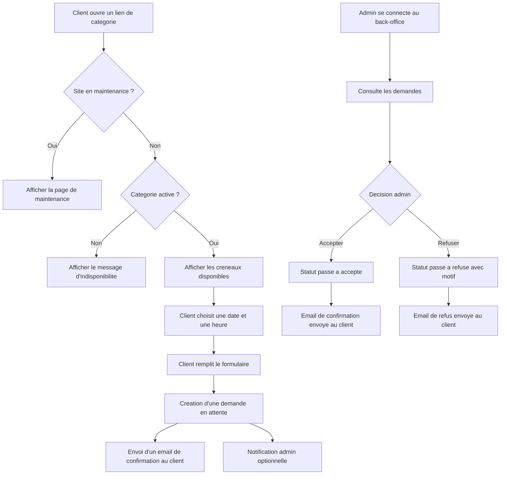

## 1. Vue d'ensemble du produit
Application web de prise de rendez-vous en ligne pour micro-entreprise, avec un parcours public simple pour les clients et un back-office privé pour un administrateur unique.
- Le produit remplace les prises de rendez-vous manuelles par une expérience structurée, accessible sur mobile, avec validation admin et notifications email.
- La valeur métier repose sur l'autonomie du client, le contrôle total de l'administrateur sur les disponibilites et la reduction des oublis ou conflits de reservation.

## 2. Fonctionnalites coeur

### 2.1 Roles utilisateurs
| Role | Mode d'acces | Permissions principales |
|------|--------------|-------------------------|
| Client | Acces public sans compte | Consulter une categorie, voir les disponibilites, envoyer une demande de rendez-vous |
| Administrateur | Connexion email/mot de passe via Supabase Auth | Gerer les categories, les indisponibilites, les demandes, le mode maintenance et les parametres du site |

### 2.2 Modules fonctionnels
1. **Page publique de categorie** : presentation du rendez-vous, calendrier de disponibilites, formulaire client, confirmation visuelle.
2. **Page d'indisponibilite globale** : affichage du mode maintenance avec message generique ou personnalise.
3. **Connexion administrateur** : authentification securisee pour acceder au back-office.
4. **Tableau de bord admin** : vue d'ensemble des rendez-vous recents, des statuts et des categories actives.
5. **Gestion des categories** : creation, edition, activation, desactivation, parametrage des jours et plages horaires, messages personnalises.
6. **Gestion des demandes de rendez-vous** : liste, filtres, detail d'une demande, acceptation, refus avec motif.
7. **Gestion des parametres globaux** : mode maintenance, indisponibilites globales, message de fermeture, informations generales.

### 2.3 Details des pages
| Nom de page | Module | Description fonctionnelle |
|-------------|--------|---------------------------|
| Page publique `/rdv/[slug]` | En-tete de categorie | Affiche le titre, la description, la duree et le mode de rendez-vous |
| Page publique `/rdv/[slug]` | Calendrier des creneaux | Affiche les jours reservables selon les regles admin, les indisponibilites et les rendez-vous deja pris ou en attente |
| Page publique `/rdv/[slug]` | Formulaire client | Collecte nom, prenom, email, telephone et message optionnel |
| Page publique `/rdv/[slug]` | Etats speciaux | Affiche un message si la categorie est hors ligne, si une periode d'absence est active ou si le site est en maintenance |
| Page publique `/rdv/[slug]/confirmation` | Confirmation | Confirme l'envoi de la demande avec statut en attente |
| Page `/maintenance` | Indisponibilite generale | Remplace les pages publiques quand le mode maintenance est actif |
| Page `/admin/login` | Authentification | Formulaire de connexion admin via Supabase Auth |
| Page `/admin` | Tableau de bord | Resume les rendez-vous, indicateurs rapides et raccourcis de gestion |
| Page `/admin/categories` | Liste des categories | Affiche les categories avec statut, slug, duree, type et actions |
| Page `/admin/categories/nouvelle` | Creation categorie | Permet de definir toutes les regles de reservation d'une categorie |
| Page `/admin/categories/[id]` | Edition categorie | Met a jour les disponibilites, indisponibilites et messages |
| Page `/admin/rendez-vous` | Liste des demandes | Filtres par statut, categorie, date et recherche rapide |
| Page `/admin/rendez-vous/[id]` | Detail demande | Visualise les informations client et permet d'accepter ou refuser |
| Page `/admin/parametres` | Parametres globaux | Active le mode maintenance et gere les indisponibilites globales |

## 3. Parcours coeur
Le client ouvre un lien public correspondant a un type de rendez-vous. Si le site n'est pas en maintenance et si la categorie est en ligne, il consulte les creneaux autorises par les regles de disponibilite, choisit une date et une heure, puis envoie sa demande via le formulaire. La demande est enregistree avec le statut `en_attente`, un email de confirmation est envoye au client et l'administrateur peut ensuite accepter ou refuser la demande depuis le back-office.

L'administrateur se connecte au back-office, configure les categories, definit les horaires et periodes d'indisponibilite, puis traite les demandes. Lors d'une validation, le client recoit un email de confirmation. Lors d'un refus, le client recoit un email incluant le motif saisi par l'administrateur.

## 4. Conception de l'interface utilisateur
### 4.1 Direction visuelle
- Style general : professionnel, rassurant, premium discret, avec une lecture rapide sur mobile
- Couleurs principales : bleu nuit, ivoire clair, vert de validation, rouge leger pour les indisponibilites
- Boutons : arrondis moyens, contraste fort, etats hover et focus visibles
- Typographie : une police d'affichage elegante pour les titres et une police de lecture neutre pour les contenus
- Mise en page : desktop-first avec colonnes respirantes, cartes structurees et parcours mobile en une seule colonne
- Iconographie : pictogrammes lineaires sobres pour duree, localisation, telephone, visio et statuts

### 4.2 Apercu des pages
| Nom de page | Module | Elements UI |
|-------------|--------|-------------|
| Page publique | Hero de categorie | Titre fort, badge de duree, badge de type de rendez-vous, resume de service |
| Page publique | Calendrier | Grille de dates, creneaux sous forme de boutons, etats bloque, disponible, selectionne |
| Page publique | Formulaire | Champs a validation inline, message d'aide, recapitulatif du creneau choisi |
| Page publique | Confirmation | Carte de succes, rappel du statut en attente, prochaines etapes |
| Back-office | Navigation admin | Barre laterale simple, sections Rendez-vous, Categories, Parametres |
| Back-office | Tableaux de donnees | Filtres, badges de statut, recherche, actions contextuelles |
| Back-office | Formulaires de configuration | Sections bien segmentees pour contenu, disponibilites, indisponibilites et publication |
| Maintenance | Ecran plein | Message fort, tonalite calme, eventuelle date de retour ou consigne alternative |

### 4.3 Responsive
Le produit adopte une approche desktop-first avec adaptation mobile prioritaire sur les parcours critiques. Le calendrier, les filtres et les formulaires doivent rester exploitables au pouce, avec des zones tactiles larges, une saisie simplifiee et des retours visuels immediats.

## 5. Regles metier essentielles
- Une categorie peut etre publiee ou hors ligne. Hors ligne, aucun nouveau rendez-vous ne peut etre demande.
- Le mode maintenance a priorite sur toutes les categories publiques.
- Les indisponibilites globales bloquent toute reservation, meme si une categorie est active.
- Les indisponibilites de categorie bloquent uniquement la categorie concernee.
- Un creneau ne doit jamais etre propose s'il entre en conflit avec un rendez-vous deja `en_attente` ou `accepte`.
- La duree du rendez-vous determine la generation des creneaux dans les plages horaires.
- Le client ne cree pas directement un rendez-vous confirme, mais une demande a valider.

## 6. Contraintes non fonctionnelles
- Application deployee sur Vercel avec variables d'environnement pour Supabase et l'envoi d'emails.
- Donnees securisees avec Row Level Security sur Supabase.
- Performance correcte sur mobile 4G et compatibilite navigateurs modernes.
- Accessibilite minimum : contraste suffisant, navigation clavier, labels explicites et gestion des messages d'erreur.
- README obligatoire pour l'installation, la configuration Supabase, le deploiement Vercel et la creation du premier compte admin.
